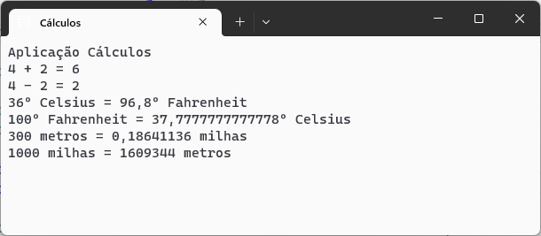

# cálculos :1234:

Aplicação C# para efetuar diversos tipos de cálculos

desenvolvida no âmbito da ação de formação **introdução ao Git  e GitHub**

## Operações suportadas

Neste momento esta aplicação implementa as seguintes operações:
- soma
- subtração
- conversões de temperaturas
  - celsius :arrow_right: fahrenheit
  - fahrenheit :arrow_right: celsius
- conversão de distâncias:
  - metros :arrow_right: milhas
  - milhas :arrow_right: metros

## Tecnologias utilizadas neste projeto

- Visual studio
- C#
- Git
- GitHub Desktop
- Plataforma GitHub

